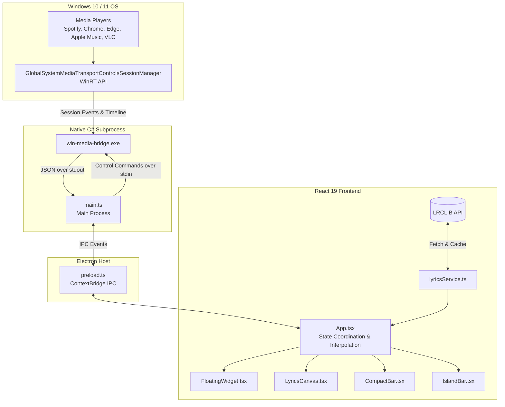

# Universal Desktop Lyrics — Developer Guide

Welcome to the **Universal Desktop Lyrics** developer documentation. This guide details the architecture, build pipeline, native integrations, and development workflows for contributors and maintainers.

---

## 🏛️ System Architecture

Universal Desktop Lyrics is built using a multi-tiered architecture that bridges native Windows 10/11 media subsystem APIs with a high-performance modern React UI inside Electron.



---

## 🛠️ Prerequisites & Environment Setup

### 1. Requirements
- **Operating System**: Windows 10 (Build 1809+) or Windows 11.
- **Node.js**: `v18.0.0` or later (LTS recommended).
- **Package Manager**: `npm` (comes with Node.js).
- **C# Compiler**: Native Windows `csc.exe` (included by default in `C:\Windows\Microsoft.NET\Framework64\v4.0.30319\csc.exe`).
- **Windows Kits Metadata**: `Windows.winmd` (automatically detected from Windows Kits 10 UnionMetadata).

### 2. Initial Setup
Clone the repository and install dependencies:
```bash
git clone <repo-url>
cd "Desktop Lyrics"
npm install
```

---

## 🏗️ Build Pipeline & Scripts

The project compiles via three coordinated build steps:

| NPM Script | Command | Purpose |
| :--- | :--- | :--- |
| `npm run build:bridge` | `powershell -ExecutionPolicy Bypass -File ./native/build-bridge.ps1` | Compiles `native/win-media-bridge.cs` into `native/win-media-bridge.exe` using WinRT metadata. |
| `npm run build:electron` | `node build-electron.js` | Bundles `src/main/main.ts` and `src/preload/preload.ts` using `esbuild`. |
| `npm run build:renderer` | `vite build` | Transpiles React TSX and Vanilla CSS into production assets in `dist/`. |
| `npm run build` | *Runs all 3 build scripts* | Generates complete production-ready artifacts. |
| `npm run dev` | `npm run build && electron .` | Rebuilds and launches the app in live development mode. |
| `npm start` | `electron .` | Runs the compiled Electron app directly. |
| `npm run dist` | `npm run build && npx electron-builder --config electron-builder.json` | Packages standalone NSIS installer & portable `.exe` into `release/`. |
| `npm run dist:portable` | `npm run build && npx electron-builder --win portable --config electron-builder.json` | Packages single portable executable only. |

---

## 🧩 Deep Dive: Subsystems

### 1. Native Windows Media Bridge (`native/`)
- **Source**: [`native/win-media-bridge.cs`](file:///c:/Users/diwas/Projects/Desktop%20Lyrics/native/win-media-bridge.cs)
- **Compiler**: [`native/build-bridge.ps1`](file:///c:/Users/diwas/Projects/Desktop%20Lyrics/native/build-bridge.ps1)
- **Role**: Communicates with the WinRT `GlobalSystemMediaTransportControlsSessionManager` to detect active playback across any app.
- **Live Playtime Calculation**:
  Windows GSMTC reports static snapshots of timeline position (`timeline.Position`) along with `timeline.LastUpdatedTime`. The bridge continuously calculates real-time position:
  $$\text{CurrentPosition} = \text{Position} + (\text{UtcNow} - \text{LastUpdatedTime})$$
- **Standard I/O Protocol**:
  - Emits newline-delimited JSON objects over `stdout`:
    ```json
    {"type":"track_change","data":{"title":"Song","artist":"Artist","positionMs":1234,"durationMs":200000,"status":"Playing"}}
    ```
  - Accepts commands over `stdin`: `play`, `pause`, `toggle`, `next`, `previous`, `seek:<ms>`.
- **Fault Tolerance**: Stdin loop is guarded with robust exception handling and Electron automatically respawns the bridge if terminated.

---

### 2. Electron Main Process (`src/main/`)
- **Source**: [`src/main/main.ts`](file:///c:/Users/diwas/Projects/Desktop%20Lyrics/src/main/main.ts)
- **Window Management**:
  - Transparent, frameless window with `alwaysOnTop: true ('screen-saver')`.
  - `skipTaskbar: true` hides the app from the Windows taskbar, running cleanly as an overlay.
  - Multi-mode resizing & positioning:
    - **Widget**: `500x260px`
    - **Full Canvas**: `500x680px`
    - **Compact Bar**: `520x84px`
    - **Top Dynamic Island**: `680x36px` docked flush at top-center (`x: center, y: 0`).
- **System Tray**:
  - Persistent icon in the notification area with full control menu.
  - Intercepts window minimize and close events to hide into the tray rather than terminating background synchronization.
- **Click-Through (Ghost Mode)**:
  - Global hotkey `Ctrl + Shift + X` toggles click-through via `mainWindow.setIgnoreMouseEvents`.
  - Auto-recovery: Hovering over the top bar restores mouse focus so users can toggle off ghost mode.

---

### 3. Preload Bridge (`src/preload/`)
- **Source**: [`src/preload/preload.ts`](file:///c:/Users/diwas/Projects/Desktop%20Lyrics/src/preload/preload.ts)
- **Security**: Context isolation enabled, exposing only strictly typed APIs via `window.desktopLyrics`:
  - `onMediaEvent(callback)`
  - `onModeChanged(callback)`
  - `sendMediaCommand(cmd)`
  - `setWindowMode(mode)`
  - `setAlwaysOnTop(val)`
  - `setClickThrough(val)`
  - `setOpacity(val)`
  - `alignTopCenter()`
  - `minimize()` / `close()`

---

### 4. React Frontend (`src/renderer/`)
- **State Coordinator** ([`App.tsx`](file:///c:/Users/diwas/Projects/Desktop%20Lyrics/src/renderer/src/App.tsx)):
  - Manages playback status, current playtime interpolation, active lyric index, and app settings.
  - Interpolates playtime continuously using `requestAnimationFrame` + 100ms sync ticks.
- **Lyrics Engine**:
  - [`lyricsService.ts`](file:///c:/Users/diwas/Projects/Desktop%20Lyrics/src/renderer/src/services/lyricsService.ts): Connects to LRCLIB with smart string cleaning (strips `(Official Video)`, `[Lyrics]`, etc.) and caches responses in `localStorage`.
  - [`lrcParser.ts`](file:///c:/Users/diwas/Projects/Desktop%20Lyrics/src/renderer/src/utils/lrcParser.ts): Parses LRC timestamps (`[mm:ss.xx]`) and marks instrumental pauses.
- **UI Components**:
  - [`TitleBar.tsx`](file:///c:/Users/diwas/Projects/Desktop%20Lyrics/src/renderer/src/components/TitleBar.tsx): Frameless header with mode switchers, transparency toggle, and window controls.
  - [`LyricsCanvas.tsx`](file:///c:/Users/diwas/Projects/Desktop%20Lyrics/src/renderer/src/components/LyricsCanvas.tsx): Apple Music-style kinetic scrolling lyrics with viewport bounding-box active line auto-centering.
  - [`FloatingWidget.tsx`](file:///c:/Users/diwas/Projects/Desktop%20Lyrics/src/renderer/src/components/FloatingWidget.tsx): Mini translucent card.
  - [`CompactBar.tsx`](file:///c:/Users/diwas/Projects/Desktop%20Lyrics/src/renderer/src/components/CompactBar.tsx): Slim pill bar with dead-center lyrics.
  - [`IslandBar.tsx`](file:///c:/Users/diwas/Projects/Desktop%20Lyrics/src/renderer/src/components/IslandBar.tsx): Top-docked Dynamic Island with click-to-snap and idle controls hiding.
  - [`SettingsModal.tsx`](file:///c:/Users/diwas/Projects/Desktop%20Lyrics/src/renderer/src/components/SettingsModal.tsx): Theme selection (Deep Glass, Aurora, Cyberpunk, Midnight, OLED) and opacity.
  - [`ManualSearchModal.tsx`](file:///c:/Users/diwas/Projects/Desktop%20Lyrics/src/renderer/src/components/ManualSearchModal.tsx): Manual search modal for obscure songs.
- **Design System** ([`index.css`](file:///c:/Users/diwas/Projects/Desktop%20Lyrics/src/renderer/src/styles/index.css)):
  - Frosted glassmorphism (`backdrop-filter: blur(28px)`).
  - Ambient floating color aura behind text.
  - High-contrast text shadows ensuring readability over any wallpaper.

---

## 🎨 Adding New Features

### Adding a New Theme
1. Open [`src/renderer/src/styles/index.css`](file:///c:/Users/diwas/Projects/Desktop%20Lyrics/src/renderer/src/styles/index.css).
2. Define a theme block modifying CSS variables:
   ```css
   .app-container[data-theme="my-theme"] {
     --bg-app: rgba(10, 15, 30, 0.7);
     --accent-color: #38bdf8;
     --accent-glow: rgba(56, 189, 248, 0.4);
   }
   ```
3. Add the theme option to `THEMES` array in [`SettingsModal.tsx`](file:///c:/Users/diwas/Projects/Desktop%20Lyrics/src/renderer/src/components/SettingsModal.tsx).

### Adding a New Lyric Provider
1. Open [`src/renderer/src/services/lyricsService.ts`](file:///c:/Users/diwas/Projects/Desktop%20Lyrics/src/renderer/src/services/lyricsService.ts).
2. Implement your fallback query function (e.g. Musixmatch, NetEase, or Genius).
3. Chain it inside `fetchLyrics()` if LRCLIB returns a 404.

---

## 📦 Packaging & Distribution

Packaging configuration is managed in [`electron-builder.json`](file:///c:/Users/diwas/Projects/Desktop%20Lyrics/electron-builder.json):
- Targets:
  - **NSIS Setup Wizard** (`release/Desktop Lyrics Setup <version>.exe`): Multi-language installer with desktop shortcuts.
  - **Portable Executable** (`release/Desktop Lyrics <version>.exe`): Standalone single-file binary.
- Extra Resources: Automatically bundles `native/win-media-bridge.exe` and `logo_icon.png` into `resources/`.

To package:
```bash
npm run dist
```
Outputs are written to the `release/` directory.

---

## 🐛 Troubleshooting & Debugging

- **Bridge not detecting songs**:
  Ensure Windows Media Player, Spotify, Chrome, or your browser is playing audio and has media keys integration enabled (e.g., in Chrome: `chrome://flags/#hardware-media-key-handling`).
- **File lock on build (`EBUSY`)**:
  If `npm run build` or `npm run dev` fails with `EBUSY`, ensure any running `electron.exe` or `win-media-bridge.exe` processes are closed in Task Manager.
- **Inspection**:
  To open Chrome DevTools in development, add `mainWindow.webContents.openDevTools({ mode: 'detach' });` inside `createWindow()` in [`src/main/main.ts`](file:///c:/Users/diwas/Projects/Desktop%20Lyrics/src/main/main.ts).
